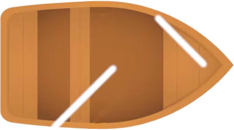

# Dokumentacja specyfikacji funkcjonalnej systemu symulacji żaglówki

> Dokument opisuje wymagania funkcjonalne dla systemu symulacji żaglówki. Przeznaczony jest dla zespołu programistów, którzy na jego podstawie mają zaimplementować oprogramowanie.

## Spis Treści
1. [Cel systemu](#)
2. [Zakres funkcjonalny](#)
3. [Wymagania funkcjonalne](#)
4. [Przypadki użycia](#)
6. [Wymagania niefunkcjonalne](#)
6. [Technologie i ograniczenia](#)
6. [Inne uwagi](#)
6. [Plany na przyszłość](#)
6. [Kontakt](#)

## 1. Cel systemu
System symulacji żaglówki ma umożliwiać użytkownikom symulacje sterowanie łódką w zależności od wygenerowanego kierunku wiatru.

## 2. Zakres funkcjonalny
System będzie składał się z następujących modułów:
| Moduł                         	|                                                   Opis                                                   	                           |
|-------------------------------	|:-----------------------------------------------------------------------------------------------------------------------------------: |
| Generowanie wiatru            	| Odpowiedzialny za losowanie kierunku wiatru                                                              	                           |
| Sterowanie łódką              	| Odpowiedzialny za obrót łódki w prawą bądź lewo o określoną ilość stopni                                  	                        |
| Obliczanie prędkości łódki  	| Odpowiedzialny za dynamiczną zmianę prędkości w zależności od kąta natarcia wiatru na żagiel oraz automatyczne dostosowanie żagli	   |
| Poruszanie łódką               | Odpowiedzialny za dynamiczną aktualizację położenia łódki na ekranie                                                                 |

## 3. Wymagania funkcjonalne
### 3.1 Moduł generowania wiatru  

#### Opis:
- **Funkcja 1:** Wylosowanie kierunku wiatru (0-359°) na początku działania systemu.
- **Funkcja 2:** Aktualizacja wartości wiatru oraz obrót obrazka kompasu w zależności od wylosowanego kierunku wiatru.

#### Dane wejściowe:
- Brak danych wejściowych dla początkowego losowania.

#### Dane wyjściowe:
- Wartość wiatru w zakresie 0-359°.

#### Mechanizm działania:
1.  Wiatr jest losowany na początku działania systemu.
2.  Wartość wiatru mieści się w zakresie 0-359°.
3.  Wylosowana wartość jest wyświetlana w postaci obrazka kompasu odpowiednio obróconego wskazującego kierunek wiatru.

#### Zasoby:
- Obrazek kompasu:


### 3.2 Moduł sterowania łódką

#### Opis:
Moduł sterowania łódką odpowiada za obrót łódki w prawo lub lewo o określoną ilość stopni. Użytkownik ma możliwość sterowania poprzez interfejs graficzny, gdzie dostępne są dwa przyciski umożliwiające zmianę kierunku.
- **Funkcja 1:** Obrót łódki w lewo
   - Po naciśnięciu przycisku `<`, łódka obraca się o 10° w lewo.
   - Kąt zmniejsza się o 10° z każdym kliknięciem.
   - Jeśli kąt spadnie poniżej 0°, przeskakuje do 350°.
- **Funkcja 2:** Obrót łódki w prawo
   - Po naciśnięciu przycisku `>`, łódka obraca się o 10° w prawo.
   - Kąt zwiększa się o 10° z każdym kliknięciem.
   - Jeśli kąt przekroczy 360°, resetuje się do 0°.
- **Funkcja 3:** Wizualizacja obrotu łódki
   - Obraz łódki obraca się w czasie rzeczywistym po każdej zmianie kąta.

#### Dane wejściowe:
- Argument typu liczbowego zawierająca aktualny kąt łódki.

#### Dane wyjściowe:
- Aktualny kąt łódki typu liczbowego.

#### Zasoby:
- Obrazek łódki:


### 3.3 Moduł obliczania prędkości łódki

#### Opis:
Moduł odpowiedzialny za dynamiczną zmianę prędkości łódki w zależności od kąta natarcia wiatru na żagiel oraz automatyczne dostosowanie żagli.
- **Funkcja 1:** Obliczanie prędkości w zależności od kąta wiatru
   - Prędkość łódki jest obliczana na podstawie kąta względem wiatru.
   - Prędkość domyślna jest mnożona przez odpowiedni stosunek (tabela poniżej), zależny od kąta względem wiatru.
- **Funkcja 2:** Automatyczne dostosowanie żagli
   - Moduł dynamicznie aktaulizuje obrazek ustawienia żagli w zależności od obliczonej nazwy wiatru.
 
| Nazwa wiatru 	| Stosunek prędkości do domyślnej 	| Kąt żaglówki względem wiatru 	|
|--------------	|:-------------------------------:	|:----------------------------:	|
| Kąt martwy   	| 0                               	| 0° - 15° oraz 346° - 360°    	|
| Bejdewind    	| 0.25                            	| 16° - 45° oraz 316° - 344°   	|
| Półwiatr     	| 0.5                             	| 46° - 90° oraz 271° - 315°   	|
| Baksztag     	| 0.75                            	| 91° - 135° oraz 226° - 270°  	|
| Fordewind    	| 1                               	| 136° - 225°                  	|

#### Dane wejściowe:
- Argument typu liczbowego zawierająca aktualny kąt łódki.
- Argument typu zmiennoprzecinkowego zawierający prędkość domyślną.

#### Dane wyjściowe:
- Obliczona prędkość łódki typu zmiennoprzecinkowego.

#### Zasoby:
- Obrazki ustawienia żagli:
  1. Kąt martwy:
  

  2. Fordewind:
  

  3. Prawy żagiel:
  

  4. Lewy żagiel:
  

### 3.4 Moduł poruszania łódką   

#### Opis:
Moduł odpowiedzialny za dynamiczną aktualizację położenia łódki na ekranie.
- **Funkcja 1:** Aktualizacja pozycji łódki
   - Położenie łódki jest aktualizowane na podstawie kąta obrotu oraz prędkości.
   - Pozycja `boatX` oraz `boatY` jest obliczana na podstawie funkcji trygonometrycznych.
- **Funkcja 2:** Ograniczenie ruchu w obrębie oceanu
   - Pozycja łódki jest ograniczana do granic obszaru oceanu.
   - Zapobiega to wychodzeniu łódki poza ekran symulacji.

#### Dane wejściowe:
- JSON zawierający aktualne dane łódki:
```
{
  "rotation": typ liczbowy,
  "boatSpeed": typ zmiennoprzecinkowy,
  "oceanWidth": typ liczbowy,
  "oceanHeight": typ liczbowy,
}
```

#### Dane wyjściowe:
- JSON zawierający nową pozycję łódki:
```
{
   "new_position": {
      "boatX": typ liczbowy,
      "boatY": typ liczbowy
   }
}
```
#### Przykładowy algorytm aktualizacji pozycji
```csharp
double boatRadians = _rotation * Math.PI / 180;
boatX += Math.Cos(boatRadians) * boatSpeed * 0.5;
boatY += Math.Sin(boatRadians) * boatSpeed * 0.5;

boatX = Math.Max(-oceanWidth / 2 + boatWidth / 2, Math.Min(boatX, oceanWidth / 2 - boatWidth / 2));
boatY = Math.Max(-oceanHeight / 2 + boatHeight / 2, Math.Min(boatY, oceanHeight / 2 - boatHeight / 2));
```

## 4. Przypadki użycia
### Przypadek Użycia 1: Losowanie kierunku wiatru

**Aktorzy**: Użytkownik <br />
**Opis**: Aktor uruchamia aplikację i losuje kierunek wiatru, co pozwala na poznanie różnych warunków żeglarskich. Kierunek wiatru wpływa na prędkość łódki, zapewniając realistyczne odzwierciedlenie dynamiki żeglowania. <br />
**Scenariusz**: 
1. Użytkownik otwiera aplikację.
2. Aplikacja generuje losowy kierunek wiatru wraz z wizualizacją na ekranie (za pomocą kompasu)
3. Użytkownik może przejść do sterowania łódką przy uwzględnieniu aktualnych warunków wiatrowych.

### Przypadek Użycia 2: Sterowanie łódką za pomocą interfejsu użytkownika
**Aktorzy**: Użytkownik <br />
**Opis**: Aktor wykorzystuje dostępny interfejs (strzałki na ekranie) do zmiany orientacji łódki względem wiatru. Sterowanie pozwala użytkownikowi eksperymentować z różnymi strategiami żeglowania, jednocześnie zmieniając kierunek i dostosowując prędkość łódki w czasie rzeczywistym. <br />
**Scenariusz główny**:
1. Użytkownik naciska klawisz `<`, co obraca łódkę w lewo o 10°.
2. Użytkownik naciska klawisz `>`, co obraca łódkę w prawo o 10°.
3. Zmiana orientacji łódki jest wizualizowana na ekranie w formie animacji obrotu łódki.
4. Aplikacja oblicza wpływ kąta natarcia wiatru na żagiel oraz wyświetla zmodyfikowaną prędkość łódki w zależności od kierunku wiatru.
5. W czasie rzeczywistym aktor zmienia kurs i dostosowuje sterowanie w celu optymalizacji prędkości łódki.

**Scenariusz alternatywny**: <br />
5a. Gdy łódka wejdzie w martwy kąt, prędkość zostaje wyzerowana.

### Przypadek Użycia 3: Obliczanie prędkości łódki w czasie rzeczywistym
**Aktorzy**: Łódka, Użytkownik <br />
**Opis**: Aplikacja dynamicznie oblicza prędkość łódki w czasie rzeczywistym, bazując na orientacji łódki względem kierunku wiatru. Funkcja ta pozwala użytkownikowi zrozumieć wpływ kąta wiatru na osiąganą prędkość i eksperymentować z manewrami. <br />
**Scenariusz główny**:
1.  Użytkownik ustawia łódkę w określonym kierunku względem wiatru (np. półwiatr).
2. Aplikacja wylicza prędkość łódki.
3. Aplikacja wyświetla dynamicznie zmieniające się parametry prędkości wyświetlane na ekranie w panelu kontrolnym.

## 5. Wymagania niefunkcjonalne
1. Interfejs użytkownika powinien być responsywny i łatwy do obsługi, niezależnie od urządzenia, na którym jest używany (komputer, tablet, telefon).

## 6. Technologie i ograniczenia
Aplikacja wykorzystuje technologię .NET MAUI, co pozwala na tworzenie aplikacji natywnych na Androida, iOS i Windowsa przy użyciu jednej bazy kodu.

## 7. Inne uwagi
- **Modularność:** System powinien być zaprojektowany w sposób umożliwiający łatwą rozbudowę o kolejne moduły.
- **Dokumentacja API:** Dokumentacja API powinna być dostępna w formacie OpenAPI (Swagger), co umożliwi łatwe testowanie i integrację z zewnętrznymi aplikacjami.
- **Testowanie:** System powinien być dostosowany do testów jednostkowych, integracyjnych i end-to-end. Wykorzystanie narzędzi takich jak NUnit, xUnit, Selenium, i inne.
  
## 8. Plany na przyszłość
Dodanie bardziej zaawansowanego trybu, uwzględniającego:
1. **Wpływ prądów wodnych**: Symulacja kierunków i siły prądów wodnych, które wpływają na prędkość i trasę łódki.
2. **Dynamiczne zmiany pogody**: Wprowadzenie zmiennych warunków atmosferycznych, takich jak gwałtowne zmiany wiatru (szkwał) lub spadki prędkości wiatru.
3. **Rozszerzone parametry łódki**: Wprowadzenie różnych typów łódek z unikalnymi właściwościami, np. różne kształty kadłuba lub konfiguracje żagli.

## 9. Kontakt
W przypadku pytań lub opinii prosimy o kontakt z **@danekkkk**.
