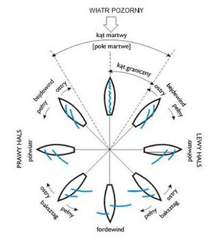

# Aplikacja do symulacji sterowania żaglówką

## 1. Założenia
Aplikacja symuluje sterowanie łodzią żaglową. Symulacja uwzględnia kierunek wiatru oraz położenie żagla względem niego. Aplikacja składa się z trzech sekcji:
1. Okna wyświetlającego dane na temat rotacji łódki, kąta padania wiatru oraz kierunku żeglarskiego.
2. Okna przedstawiającego wodę, po której porusza się łódka.
3. Sekcji z dwoma przyciskami służącymi do sterowania łódką oraz przyciskiem do generowania nowego kierunku wiatru.

## 2. Funkcjonalności aplikacji

### 2.1 Sterowanie łodzią
Przyciski „Obrót w lewo” oraz „Obrót w prawo” obracają łódź o 15° w wskazanym kierunku.

### 2.2 Generowanie wiatru
Po uruchomieniu aplikacji losowany jest kierunek wiatru. Użytkownik może zmienić kierunek wiatru, klikając przycisk „Losuj wiatr”. ```tego jakoś specjalnie nie mieliśmy w założeniach```

### 2.3 Wpływ wiatru na żagle
W zależności od kąta wiatru oraz kąta rotacji łódki, żagle automatycznie zmieniają swoje ustawienie. ```jak?```

### 2.4 Monitorowanie aktualnych danych
Aplikacja wyświetla dane dotyczące łódki oraz wiatru:
- Kąt rotacji łódki.
- Kąt padania wiatru.
- Nazwę kursu żeglarskiego (zgodnie z rysunkiem nr 1).

<br>
<br><sub>Rys. 1</sub>

## 3. Zasady

### 3.1 Sterowanie łodzią
- Łódka, w trakcie rotacji, stopniowo zmniejsza swoją prędkość w zależności od swojej orientacji względem kierunku wiatru.
- Próba płynięcia pod wiatr powoduje stopniową utratę prędkości.
- Łódź nie może wypłynąć poza granice okna z wodą.

### 3.2 Zmiana wyglądu żagli
- Wygląd żagli zmienia się w zależności od kursu żeglarskiego, zgodnie z rysunkiem nr 1.

## 4. Przypadki użycia

### Przypadek 1: Skręt w lewo
**Aktorzy:**
- Użytkownik

**Opis:**
1. Użytkownik uruchamia aplikację, jeśli nie jest jeszcze uruchomiona.
2. Użytkownik klika przycisk „Obrót w lewo”.
3. Aplikacja rejestruje naciśnięcie przycisku „Obrót w lewo”.
4. Łódka zostaje obrócona o 15° w lewo.  ```a coś z żaglami się dzieje?```

**Dane wyjściowe:**
- Zaktualizowany kąt rotacji łódki.

### Przypadek 2: Skręt w prawo
**Aktorzy:**
- Użytkownik

**Opis:**
1. Użytkownik uruchamia aplikację, jeśli nie jest jeszcze uruchomiona.
2. Użytkownik klika przycisk „Obrót w prawo”.
3. Aplikacja rejestruje naciśnięcie przycisku „Obrót w prawo”.
4. Łódka zostaje obrócona o 15° w prawo.

**Dane wyjściowe:**
- Zaktualizowany kąt rotacji łódki.

### Przypadek 3: Losowanie wiatru przez użytkownika
**Aktorzy:**
- Użytkownik

**Opis:**
1. Użytkownik uruchamia aplikację, jeśli nie jest jeszcze uruchomiona.
2. Użytkownik klika przycisk „Losuj wiatr”.
3. Aplikacja rejestruje naciśnięcie przycisku „Losuj wiatr”.
4. Aplikacja generuje nowy, losowy kąt wiatru.

**Dane wyjściowe:**
- Nowy kąt padania wiatru.

## 5. Technologie
- Platforma: .NET 9.
- Framework: .NET MAUI.

## 6. Inne uwagi
- Aplikacja posiada interfejs w języku polskim.
- Istnieje możliwość dalszej rozbudowy aplikacji o dodatkowe funkcjonalności, takie jak uwzględnienie siły wiatru lub zmiennych warunków pogodowych.
