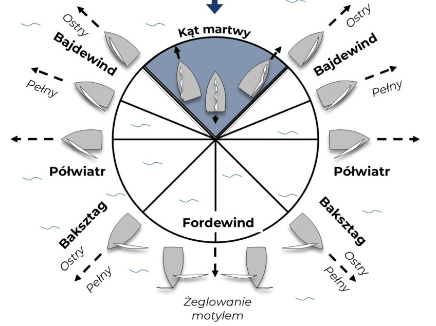

## Specyfikacja funkcjonalna aplikacji Łódka

## 1. Wstęp
Niniejszy dokument określa wymagania funkcjonalne dla aplikacji Łódka, służącej do symulacji ruchu łodzi żaglowej. Jest przeznaczony dla zespołu programistycznego odpowiedzialnego za implementację systemu.
## 2. Cel systemu
Głównym celem aplikacji jest symulacja ruchu łódki żaglowej po powierzchni wody, w zależności od kierunku wiatru i położenia łódki.

## 3. Zakres funkcjonalny
Aplikacja zawiera następujące funkcjonalności:
- **Kierunek wiatru** – moduł odpowiedzialny za wybieranie losowego kierunku wiatru.
- **Sterowanie łódką** – moduł odpowiedzialny za ruch łódki.
- **Manipulacja żaglami** – moduł odpowiedzialny za zmianę położenia żagli łódki.
- **Interfejs użytkownika** – moduł odpowiedzialny za wyświetlanie na interfejsie przydatnych dla użytkownika informacji.

## 4. Wymagania funkcjonalne
### 4.1. Kierunek wiatru
Moduł odpowiada za wybór losowego kierunku wiatru z zakresu od 1° do 360°, gdzie 360° to góra, 90° - prawo, 180° - dół itd.

### 4.2. Sterowanie łódką
Moduł odpowiada za kontrolowanie położenia łódki.
- **Skręcanie:** użytkownik może obracać łódką, używając przycisków znajdujących się na interfejsie.
- **Prędkość:** aplikacja dostosowuje prędkość łódki w zależności od jej położenia względem kierunku wiatru.
- **Przemieszczanie:** aplikacja porusza łódką w kierunku wybranym przez użytkownika i z prędkością zależną od położenia łódki względem wiatru.

### 4.3. Manipulacja żaglami
Moduł odpowiada za kontrolowanie pozycji dwóch żagli na łódce w zależności od jej położenia względem wiatru.
- **Dziobem do wiatru:** żagle powiewają swobodnie do tyłu łódki.
- **Rufą do wiatru:** dwa żagle znajdują się po przeciwnych burtach łódki.
- **Bokiem do wiatru:** oba żagle znajdują się po przeciwnej burcie niż ta skierowana na wiatr.

### 4.4. Interfejs użytkownika
Moduł odpowiada za wyświetlenie na interfejsie użytkownika informacji na temat wiatru i łódki oraz kontrolek do sterowania łódką.
- **Sterowanie łódką:** aplikacja wyświetla na interfejsie przyciski do obracania łódki w lewo i w prawo.
- **Kierunek wiatru:** aplikacja wyświetla na interfejsie informację o kierunku wiatru w formie graficznej oraz liczbowej.
- **Położenie łódki:** aplikacja wyświetla na interfejsie napis mówiący, w jakim położeniu względem wiatru znajduje się łódka (np. fordewind, baksztag, hals).

## 5. Przypadki użycia
### Przypadek 1: Płynięcie z wiatrem
**Aktor:** Osoba używająca aplikacji.
**Cel:** Użytkownik chce ustawić łódkę w symulacji tak, aby płynęła z wiatrem, przy wietrze o kierunku 270°.
**Przebieg:**
1. Użytkownik otwiera aplikację.
2. Aplikacja losuje kierunek wiatru na 270°.
3. Aplikacja wyświetla interfejs.
4. Użytkownik klika przyciski, aby obrócić łódkę w pożądanym kierunku.
5. Aplikacja obraca łódkę w kierunku, jaki nadał użytkownik.
6. Kiedy łódka jest ustawiona tyłem do wiatru, płynie szybciej.
7. Im szybciej płynie łódka, tym większy posiada promień skrętu.

### Przypadek 2: Płynięcie pod wiatr
**Aktor:** Osoba używająca aplikacji.
**Cel:** Użytkownik chce ustawić łódkę w symulacji tak, aby płynęła pod wiatr, przy wietrze o kierunku 270°.
**Przebieg:**
1. Użytkownik otwiera aplikację.
2. Aplikacja losuje kierunek wiatru na 270°.
3. Aplikacja wyświetla interfejs.
4. Użytkownik klika przyciski, aby obrócić łódkę w pożądanym kierunku.
5. Aplikacja obraca łódkę w kierunku, jaki nadał użytkownik.
6. Kiedy łódka jest ustawiona pod wiatr, zwalnia.
7. Po pewnym czasie łódka zatrzymuje się. Użytkownik nadal jest w stanie nią obracać, ale nie może ona nabrać prędkości, dopóki jest skierowana w tzw. kącie martwym.

## 6. Technologie i ograniczenia
- **Technologia:** .NET MAUI
- **Języki:** XAML, C#
- **Inne wymagania:** grafika rastrowa

## 7. Inne uwagi
- **Interfejs aplikacji:** w języku angielskim.
- **Rozbudowa:** aplikacja powinna umożliwiać łatwą rozbudowę o kolejne moduły.

## 8. Wymagania dotyczące bezpieczeństwa
- **Ochrona danych:** wszystkie dane użytkownika powinny być szyfrowane.
- **Autoryzacja:** aplikacja powinna obsługiwać mechanizmy autoryzacji, aby zapewnić dostęp do określonych funkcji tylko uprawnionym użytkownikom.
- **Bezpieczeństwo kodu:** kod aplikacji powinien być zabezpieczony przed atakami typu SQL Injection, XSS i CSRF.

## 9. Wydajność i skalowalność
- **Optymalizacja:** aplikacja powinna działać płynnie na urządzeniach mobilnych o ograniczonych zasobach.
- **Skalowalność:** architektura powinna umożliwiać przyszłe rozszerzenia bez znaczącego wpływu na wydajność.
- **Responsywność:** interfejs użytkownika powinien dynamicznie dostosowywać się do różnych rozdzielczości ekranów.

## 10. Autor

Maksym Petrushkevych

