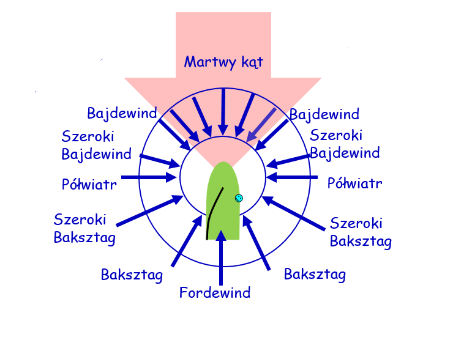

# Specyfikacja funkcjonalna aplikacji do symulacji pływania żaglówką

## 1. Wstęp
Dokument opisuje wymagania i cele aplikacji symulującej pływającą łódkę. Przeznaczony jest dla programisty, który na jego podstawie ma zaimplementować oprogramowanie.

## 2. Cel systemu
Aplikacja symulująca ruch żaglówki ma umożliwiać użytkownikom zmianę kąta pod jakim skierowany jest żagiel żaglówki, dzięki czemu symulowany wiatr wiejący z wylosowanego kierunku wpływać ma na sposób poruszania się łódki. W zależności od kierunku wiatru, obliczana jest prędkość łódki oraz nadawana jest odpowiednia nazwa wiatru np. bajdewind, baksztag. Aplikacja oferować będzie interfejs graficzny przedstawiający planszę z żaglówką.

## 3. Opis funkcjonalności
W zależności od kierunku wiatru oraz aktualnej orientacji łódki, aplikacja oblicza jej prędkość, po czym aktualizuje jej pozycję na planszy symulacyjnej.

## 4. Zakres funkcjonalny
System będzie składał się z następujących modułów:
- **Plansza** – Na planszy odbywać się będzie symulacja ruchu żaglówki. Jest to aktualny stan symulacji.
- **Żaglówka** – żaglówka poruszać się będzie po planszy w zależnosci od kierunku wiatru i ustawień żagla. Pobiera ona również dane od użytkownika (które opisane zostaną w dalszej części).
- **Wiatr** – Wiatr będzie bezpośrednio oddziaływał na zachowanie żaglówki.

## 5. Wymagania funkcjonalne
### 5.1. Plansza
**Opis:**
- Funkcja 1: Umożliwenie wyświetlenia żaglówki.
- Funkcja 2: Umożliwienie wyświetlenia i przesuwania żaglówki w zależności od ustawień żagla i wiatru.

### 5.2. Żaglówka
**Opis:**
- Funkcja 1: możliwość zmiany ustawień żagla.
- Funkcja 2: przyśpieszanie i zwalnianie w zależności od kierunku wiatru i ustawienia żagla.

**Dane wejściowe:**
- Użytkownik w trakcie trwania symulacji naciskać może przyciski 'a' oraz 'd', które bezpośrednio wpłyną na ustawienie żagla

**Dane wyjściowe:**
- Zmiana stanu gry (obrót żagla, a w konsekwencji zmiana ruchu łódki).

### 5.3. Wiatr
**Opis:**
- Funkcja 1: Ustawienie kierunku wiatru
- Funkcja 2: wywieranie wpływu na prędkość żaglówki

Dla lepszego zrozumienia zasady działania wiatru poniżej zamieszczono obraz ilustrujący kierunki wiatru:

## 6. Przypadki użycia
### Przypadek 1: Symulacja pływania żaglówki ze zmianą ustawień żagla
**Aktorzy:**
- Użytkownik aplikacji

**Cel:**
- Symulacja pływania żaglówki

**Przebieg:**
1. Użytkownik otwiera aplikację.   
2. Aplikacja losuje kierunek wiatru na 170°.   
3. Użytkownik klika przycisk obracający żaglówkę   
4. Aplikacja obraca żaglówkę w kierunku, jaki nadał użytkownik.   
5. Kiedy żaglówka jest ustawiona tyłem do wiatru, płynie szybciej.   
6. Im szybciej płynie łódka, tym większy posiada promień skrętu

### Przypadek 2: Symulacja pływnia żaglówki bez zmiany ustawień żagla
**Aktorzy:**
- Użytkownik aplikacji

**Cel:**
- Symulacja pływania żaglówki

**Przebieg:**
1. Użytkownik otwiera aplikację.   
2. Aplikacja losuje kierunek wiatru na 90°.   
3. Żaglówka zaczyna płynąć prosto przed siebie.   
4. Żaglówka dociera do granicy planszy   
5. Żaglówka nie wykonuje ruchów do czasu przytrzymania przez użytkownika przycisku 'a' lub 's'  

## 7. Technologie i ograniczenia
- Język: C# 13
- Framework: .NET MAUI
- Technologia: .NET 13
- Inne wymagania: grafika rastrowa, interfejs użytkownika wykonany przy pomocy XAML.

## 8. Inne uwagi
- Aplikacja powinna umożliwiać rozbudowę o kolejne moduły i funkcjonalności.

