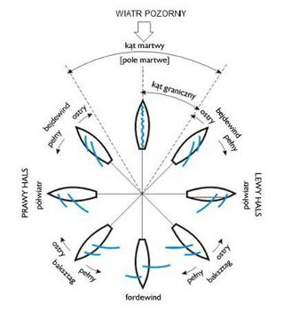

# Symulacja Żeglowania

## Cel aplikacji:
Symulacja żeglowania ma na celu edukację użytkowników w zakresie podstawowych zasad żeglowania. Aplikacja symuluje wpływ wiatru na ruch łódki, umożliwiając użytkownikowi interaktywne eksperymentowanie z kierunkiem wiatru i manewrowaniem łódką. Użytkownicy mogą lepiej zrozumieć, jak różne kierunki wiatru wpływają na prędkość i trajektorię łódki.

## Opis funkcjonalności:
- Aplikacja symuluje wiatr wiejący z różnych kierunków, co wpływa na sposób poruszania się łódki. W zależności od kierunku wiatru, obliczana jest prędkość łódki oraz nadawana jest odpowiednia nazwa wiatru (np. wiatr z kierunku północnego, południowego, zachodniego itp.).

- Użytkownik ma możliwość obracania łódki za pomocą przycisków AD (lub strzałek na klawiaturze). Możliwe jest również kontrolowanie jej ruchu przy pomocy dedykowanych przycisków sterujących, co umożliwia manewrowanie łódką w symulacji.

- Kierunek wiatru jest losowo wybierany na początku symulacji oraz po każdorazowym naciśnięciu przycisku, który generuje nowy kierunek wiatru. Pozwala to na eksperymentowanie z różnymi warunkami żeglarskimi.

- W zależności od kierunku wiatru oraz aktualnej orientacji łódki, aplikacja oblicza jej prędkość. Symulacja uwzględnia zasady fizyki żeglowania, takie jak prędkość wiatru, kąt natarcia wiatru na żagle oraz opór wody.

-  Aplikacja oferuje intuicyjny interfejs graficzny, który umożliwia łatwe sterowanie łódką oraz śledzenie zmieniających się warunków wiatrowych. Na ekranie widoczny jest zarówno sam ekran symulacji, jak i panel sterowania, na którym użytkownik może wybrać odpowiednie opcje sterowania.

## Diagramy kierunków wiatru
Aby lepiej zobrazować wpływ różnych kierunków wiatru na żeglowanie, poniżej znajduje się przykładowy diagram. Użytkownik może wprowadzać zmiany w położeniu łódki, dostosowując ją do zmieniających się kierunków wiatru.

  

# Przypadki Użycia:
### Przypadek Użycia 1: Losowanie kierunku wiatru

<b>Aktor:</b> Użytkownik 
<b>Opis:</b> Po uruchomieniu aplikacji użytkownik naciska przycisk, który losuje kierunek wiatru. 
<b>Scenariusz:</b>
- Użytkownik uruchamia aplikację.
- Aplikacja losowo generuje kierunek wiatru.
- Użytkownik widzi wybrany kierunek wiatru oraz prędkość łódki.
- Kierunek wiatru jest wyświetlony na ekranie.

### Przypadek Użycia 2: Sterowanie łódką

<b>Aktor:</b> Użytkownik 
<b>Opis:</b> Użytkownik steruje łódką, używając przycisków AD (lub strzałek) do obracania jej. 
<b>Scenariusz:</b>
- Użytkownik naciska klawisz A lub strzałkę w lewo, aby obrócić łódkę w lewo.
- Użytkownik naciska klawisz D lub strzałkę w prawo, aby obrócić łódkę w prawo.
- Łódka zmienia kierunek, a jej prędkość dostosowuje się do nowej orientacji.
- Łódka zmienia kierunek i prędkość w zależności od ustawionego kierunku wiatru.

### Przypadek Użycia 3: Zmiana kierunku wiatru

<b>Aktor:</b> Użytkownik 
<b>Opis:</b> Użytkownik zmienia kierunek wiatru za pomocą przycisku, aby zobaczyć, jak wpłynie to na prędkość łódki. 
<b>Scenariusz:</b>
- Użytkownik naciska przycisk „Losuj Wiatr”.
- Nowy kierunek wiatru jest generowany losowo.
- Aplikacja oblicza nową prędkość łódki i wyświetla ją.
- Kierunek wiatru oraz prędkość łódki są zmieniane zgodnie z nowymi warunkami wiatrowymi.

### Przypadek Użycia 4: Obserwacja zmieniającej się prędkości łódki

<b>Aktor:</b> Użytkownik 
<b>Opis:</b> Użytkownik monitoruje zmieniającą się prędkość łódki w zależności od kierunku wiatru oraz manewrowania łódką. 
<b>Scenariusz:</b>
- Użytkownik steruje łódką, zmieniając jej kąt względem wiatru.
- Aplikacja oblicza prędkość łódki w czasie rzeczywistym.
- Użytkownik obserwuje zmieniającą się prędkość w zależności od manewrów.
- Prędkość łódki jest wyświetlana na ekranie w zależności od jej orientacji względem wiatru.

# Planowane funkcjonalności
- Dodanie elementów takich jak fale, zmieniająca się intensywność wiatru, czy inne zmienne atmosferyczne.
- Możliwość rywalizowania z innymi użytkownikami o jak najszybsze pokonanie określonej trasy w określonych warunkach wiatrowych.

# Podsumowanie
Symulacja żeglowania to interaktywna aplikacja edukacyjna, która pomaga użytkownikom zrozumieć zasady wpływu wiatru na ruch łódki. Dzięki prostemu sterowaniu i losowym warunkom wiatrowym, użytkownicy mogą testować różne manewry i szybko dostrzegać, jak zmieniające się warunki wiatrowe wpływają na prędkość łódki i jej kierunek.